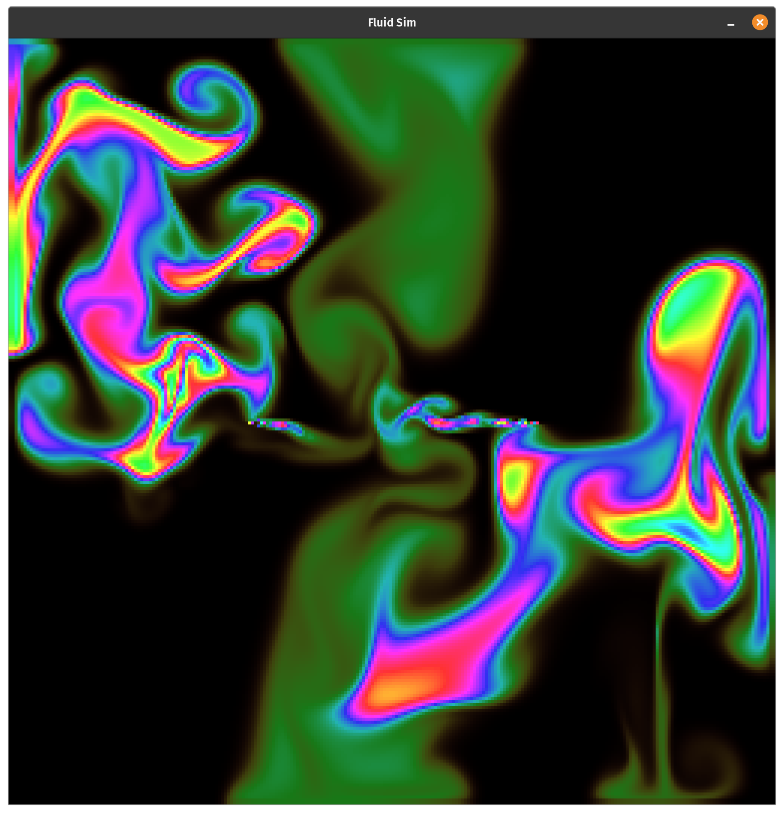

# FluidSimulation
A 2D demonstration of Mike Ash's Fluid Simulation (https://mikeash.com/pyblog/fluid-simulation-for-dummies.html) written in C++ using the SFML library.

# Controls
| Command |              Action              |
|:-------:|:--------------------------------:|
|  Space  |              Pause               |
|LMB Click|  Add density at mouse position   |
|RMB Drag |Add velocity in direction of mouse|
